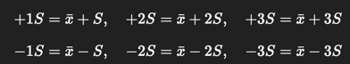

## Общее описание

Данный проект реализует **систему для медицинской лаборатории и аптеки**, которая включает в себя:

1. **Модуль формирования отчётов**, позволяющий:
    - **Контролировать качество** (рассчитывать статистические параметры, отображать графики с ±1S, ±2S, ±3S).
    - **Анализировать оказанные услуги** (количество услуг, список оказанных услуг, число пациентов и т.д. за заданный период).

2. **Базу данных** (MySQL), в которой хранится информация об:
    - Поставщиках, медикаментах, партиях, складах, заказах на поставку, сотрудниках, клиентах, истории покупок, контрактах, счетах и записях на приём и пр.
    - Структура БД **нормализована** до **3-й нормальной формы**.
    - Приложено **ER-диаграмма** (например, в виде `.drawio` или изображения).

3. **Окно редактирования данных пациента** (или клиента) – доступно только соответствующему персоналу (например, лаборанту, который создаёт заказ на услугу).

Приложение реализовано на **Python + PyQt6**, взаимодействие с БД происходит через MySQL. Также предусмотрен экспорт отчётов в **PDF** с использованием библиотеки `reportlab`.

---

## Основные требования

### 1. Контроль качества

Контроль качества (КК) в медицинской лаборатории — это статистический процесс, который помогает проверять точность результатов исследования проб пациентов. Для этого в системе реализованы:

- **Вычисление** среднего значения результатов (X), среднеквадратичного отклонения (S), коэффициента вариации (CV).
- **Статистические пределы**:
    - +1S, +2S, +3S,
    - -1S, -2S, -3S.
- **График** с нанесёнными контрольными линиями (±1S, ±2S, ±3S) и датами/временем исследований по оси X.
- **Выбор** периода (с точностью до дня).
- Отображение в **табличном** виде либо в виде **графика**, а также возможность **выгружать в PDF** (только таблицу, только график или оба варианта).

### 2. Отчёт по оказанным услугам

- Подсчёт количества оказанных услуг за заданный период.
- Перечень услуг за тот же период.
- Количество пациентов, количество пациентов в день по каждой услуге.
- Средний результат исследования в день (при необходимости).
- Выбор периода (с точностью до дня).
- Отображение в таблице или графике.
- Выгрузка в PDF.

### 3. Окно редактирования пациента

- Отдельная форма, доступная только лаборанту (или другому сотруднику с нужными правами).
- Возможность изменять базовые данные пациента (ФИО, телефон, дата рождения и т.д.).
- Сохранение изменений в базе данных.

### 4. Проектирование ПО (ER-диаграмма)

- Разработана ER-диаграмма для **информационной системы аптеки** в соответствии с описанной предметной областью.
- Включает хранение данных о:
    - Поставщиках (юридические реквизиты, ИНН, договор, телефон и т.д.).
    - Препаратах, их количестве, партиях, цене, процентах скидки, связанных поставщиках.
    - Сотрудниках (ФИО, адрес, должность, контактная информация).
    - Заказах на поставку (датах, отгрузках, составе заказа).
    - Клиентах (ФИО, почта, телефон, скидка), истории их покупок.
    - Специалистах (окулист, ортопед), записи клиентов на приём, кабинетах, оборудовании, материалах, складах, категориях расходных материалов, остатках и сроках годности.
    - Контрактах, возможной частичной оплате, выставляемых счетах.
- Диаграмма выполнена в **3-й нормальной форме**, чтобы избежать избыточности данных и обеспечить простоту сопровождения.

---

## Установка и запуск

1. **Клонируйте** репозиторий или скопируйте его содержимое на локальную машину:

   ```bash
   git clone https://github.com/nevasik/medical-laboratory.git
   ```

2. **Установите зависимости** (Python 3.9+):
   ```bash
   pip install <название зависимости>
   ```
   В списке зависимостей, как правило, указаны:
    - `PyQt6`
    - `pymysql`
    - `reportlab`
    - `matplotlib`

3. **Подключение к базе данных**:
    - В файле конфигурации config.yml пропишите параметры подключения к MySQL (хост, пользователь, пароль, название БД).

4. **Запуск приложения**:
   ```bash
   python main.py
   ```

5. По умолчанию приложение:
    - Создаёт (или обновляет) структуру таблиц в БД.
    - Открывает главное окно PyQt6:
        - В меню доступно “Сформировать отчёт” (контроль качества / услуги).
        - В меню “Пациенты” можно открыть окно редактирования данных пациента.
---

## Использование

- В главном меню выберите:
    - **“Отчёты”** → **“Сформировать отчёт”**
        - Укажите **тип отчёта** (“Контроль качества” или “Оказанные услуги”).
        - Выберите **период** (даты).
        - Укажите **форму представления** (график или таблица).
        - Нажмите **“Сформировать”**.
        - При необходимости нажмите **“Экспорт в PDF”**, выбрав нужный режим (только таблица, только график, или оба вместе).
- Для **контроля качества**:
    - Программа считает среднее, стандартное отклонение, коэффициент вариации и строит линии ±1S, ±2S, ±3S на графике.
- Для **отчёта по услугам**:
    - Можно увидеть количество оказанных услуг, список услуг, число пациентов, средние результаты исследований за день и т.д.
- **Окно редактирования пациента** открывается из меню “Пациенты” и позволяет изменить данные конкретного пациента (ФИО, телефон и пр.).

---

## Содержание репозитория

- **main.py** (или другой стартовый файл) – точка входа, в которой:
    - Создаётся/обновляется схема БД.
    - Запускается приложение PyQt6.
- **db.py** (или аналог) – функции для подключения к базе, создания таблиц.
- **reports_window.py** – окно для формирования и отображения отчётов.
- **patient_editor.py** – окно редактирования пациента.
- **pdf_export.py** – логика экспорта в PDF (с использованием `reportlab`).
- **models/** – (опционально) модули, отражающие сущности БД.
- **ER-диаграмма** (например, `ERDiagram.drawio` или изображение) – визуальное представление структуры БД.

---

## Контрольные формулы

1. **Среднеквадратичное отклонение (S)**:


2. **Статистические пределы** (при среднем \(\bar{x}\)):

   

3. **Коэффициент вариации (CV)**:
    

---

## ER-диаграмма аптеки

- Основные сущности: **Поставщик (supplier)**, **Склад (warehouse)**, **Категория (category)**, **Оборудование/материалы (equipment)**, **Медикаменты (medicine)**, **Партии медикаментов (medicine_batch)**, **Заказ на поставку (supply_order)**, **Состав заказа (supply_order_item)**, **Сотрудники (employee)**, **Кабинет (cabinet)**, **Клиенты (client)**, **Покупки (purchase/purchase_item)**, **Контракты (contract)**, **Счета (invoice)**, **Запись на приём (appointment)**, и т.д.
- Связи (1:M, M:M) отражают, как данные взаимодействуют в предметной области.
- Структура в 3НФ обеспечивает отсутствие избыточности и аномалий при работе с данными.

---

## Дополнительная информация

- В проекте используются **только** свободно доступные библиотеки (PyQt6, reportlab, mysql-connector-python, matplotlib).
- При необходимости доработки/уточнения отчётов (например, “количество пациентов за каждый день” или “средний результат в разрезе врачей”) – добавляются соответствующие SQL-запросы и методы в коде приложения.
- Для полноценного тестирования следует наполнить базу демо-данными (справочниками, пациентами, услугами, результатами исследования).

---

## Создатели

Проект выполнен студентами 4 курса группы 43-ИС-21:
- Абуталибов Тимур
- Седнев Андрей
- Поплаухин Дмитрий

---

### !!!!!!!!!!!!!!!!!!!!!!!!!!!!!!!!!!!!!!!!!!!!!!!!!
Первая проблема с которой я столкнулся:

Первым делом, нужно понять структуру данных в базе. 
В предоставленных таблицах есть таблица `appointment` (записи на приём) и `patient` (пациенты). 
Возможно, данные для контроля качества хранятся в этих таблицах или в других, связанных с услугами. 
Однако в описании задания упоминаются результаты услуг и контрольные материалы. 
В текущей схеме базы данных нет явной таблицы для хранения результатов исследований или контрольных измерений. 
Это может быть проблемой, так как для расчёта статистики нужны данные измерений.

Возможные варианты:
1. Предположить, что данные хранятся в существующих таблицах (например, в `appointment` или `contract`), но это маловероятно.

2. Добавить новую таблицу для хранения результатов исследований. Например:

```sql

CREATE TABLE IF NOT EXISTS test_result (

result_id INT AUTO_INCREMENT PRIMARY KEY,

appointment_id INT,

test_value DECIMAL(10,2),

test_date TIMESTAMP DEFAULT CURRENT_TIMESTAMP,

FOREIGN KEY (appointment_id) REFERENCES appointment(appointment_id)

);

```